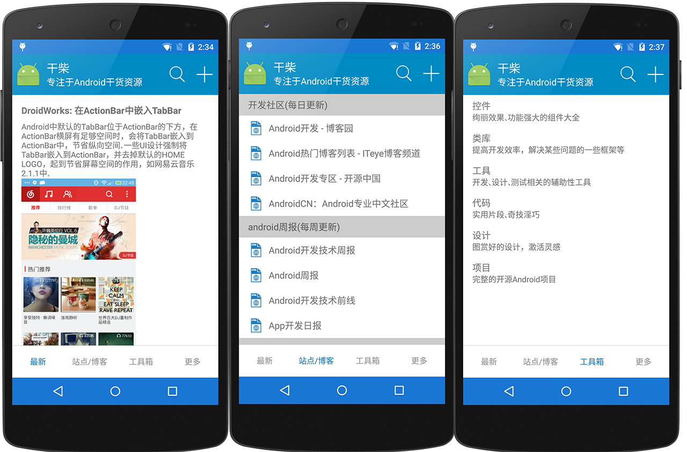

#干柴 - Android Digest
专注于android干货资源

##Next plan

###0.6
> 1. 采用Material Design

###0.7
> 1. 重构Server端

##Screenshot

##Demo
[下载地址](http://jayfeng-files.stor.sinaapp.com/androiddigest/android_digest_release_v0.5.apk)

##编译
1. 复制gradle.properties.release为gradle.properties或者把里面的内容拷贝到你的gradle.properties，可解决编译时需要release的singingConfig的错误
3. 如果提示找不到 sdk xx version 或者build Tool version, 更新一下sdk即可

##加入我们
> 1. 提交：Pull Request or Patch
> 2. 讨论：QQ群 - 451634330

##代码规范
> 1. 尽量用英文，避免乱码和提高逼格
> 2. 尽量参考Google Java Style: [中文版](http://www.hawstein.com/posts/google-java-style.html)
> 3. But, if you want, any language, any style is ok, whatever, just do it!!!
